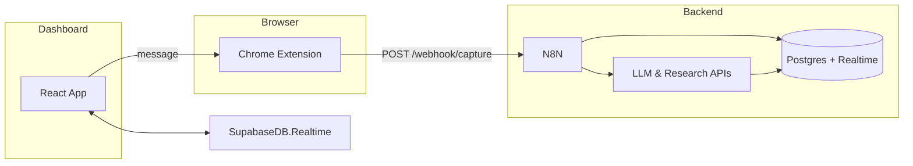

**AI-Assisted LinkedIn Comment Dashboard & Workflow PRD**

---

## 1. Purpose & Goals

**Objective:**
Build a human-in-the-loop system to capture LinkedIn posts, generate AI-crafted comment suggestions, and present them in a dedicated review dashboard for manual selection and manual posting back to LinkedIn.

**Primary Goals:**

- Seamlessly capture post metadata and content (as Markdown).
- Automate research and comment-draft generation via an AI agent.
- Provide a robust, intuitive dashboard for reviewing, editing, and selecting comment drafts.
- Keep the manual publish step external (copy/paste or future-inject).

**Out of Scope (Phase 1):**

- Auto-posting comments directly to LinkedIn.
- Notion integration.

## 2. High‑Level Workflow

1. **Capture**

   - User clicks “Save for AI” in Chrome extension while viewing a LinkedIn post.
   - Extension scrapes `postId`, author, timestamp, URL, and converts HTML to Markdown.
   - Payload → N8N webhook.

2. **Store**

   - N8N inserts into Supabase Postgres `posts` table with schema:

     ```sql
     posts(
       id UUID PK,
       post_id TEXT UNIQUE,
       author TEXT,
       url TEXT,
       markdown TEXT,
       status TEXT CHECK(status IN ('captured','researching','drafts_ready','reviewed')),
       created_at TIMESTAMPTZ DEFAULT now()
     )
     ```

3. **Research & Drafts**

   - N8N watches for new rows → fetches context via SerpAPI / news API → stores snippets in `post_research`.
   - Once research complete, N8N calls AI to produce 6–8 comment drafts → writes to `comment_drafts(post_id FK, draft_text, sequence, created_at)`.

4. **Dashboard Notification**

   - Dashboard subscribes to Supabase Realtime on `comment_drafts`.
   - New drafts trigger UI badge/alert.

5. **Review & Select**

   - User logs into Dashboard (Next.js/React + Supabase Auth).
   - Lists posts with `status='drafts_ready'`.
   - Detail view: shows rendered Markdown post, research snippets, editable drafts.
   - User picks one draft (or edits), clicks **Copy**, or **Queue for Injection** (extension message).

6. **Manual Publish**

   - User navigates back to LinkedIn post.
   - Extension listens for dashboard message and pre-fills comment box.
   - User clicks LinkedIn **Post**.

7. **Archival**

   - Upon selection, Dashboard updates `posts.status='reviewed'` and logs action in `user_actions(post_id, action, timestamp)`.

## 3. System Architecture



### 3.1 Components

| Component        | Technology           | Responsibility                                         |
| ---------------- | -------------------- | ------------------------------------------------------ |
| Chrome Extension | Manifest v3 + Plasmo | Capture posts; inject UI; handle inbound messages      |
| N8N Workflows    | N8N.io               | Webhook ingestion; research fetch; AI draft generation |
| Data Layer       | Supabase (Postgres)  | Store posts, research, drafts, actions; Realtime feed  |
| Review Dashboard | Next.js + React      | Browse posts; edit/select drafts; send messages to CX  |
| AI & Research    | OpenAI, SerpAPI/etc. | Context gathering; comment draft creation              |

## 4. Data Model

```sql
-- Posts
CREATE TABLE posts (
  id UUID PRIMARY KEY DEFAULT gen_random_uuid(),
  post_id TEXT UNIQUE NOT NULL,
  author TEXT,
  url TEXT,
  markdown TEXT,
  status TEXT NOT NULL DEFAULT 'captured',
  created_at TIMESTAMPTZ DEFAULT now()
);


-- Draft comments
CREATE TABLE comment_drafts (
  id UUID PRIMARY KEY DEFAULT gen_random_uuid(),
  post_id UUID REFERENCES posts(id) ON DELETE CASCADE,
  draft_text TEXT NOT NULL,
  sequence INT,
  created_at TIMESTAMPTZ DEFAULT now()
);

```

## 5. UX & Design Guidelines

- **Dashboard Layout**

  - **List View:** Table of { Post preview | Author | Status | #Drafts | Time }
  - **Detail Panel:**

    - Left: Rendered Markdown post + metadata + research snippets
    - Right: Grid of draft cards (editable textarea + sequence)
    - Fixed header: “Copy” & “Queue to Extension” buttons

- **States & Feedback**

  - Loading spinners for research/generation
  - Empty state messaging (“No drafts yet — try capturing a post!”)
  - Inline validation for API errors (retry button)

- **Design**

  - Follow a clean, minimal Tailwind-based aesthetic
  - Responsive breakpoints for desktop/tablet
  - Accessible color contrast, keyboard navigation
  - Card drop‑shadows, p‑4 padding, rounded-lg corners

## 6. Edge Cases & Mitigations

| Scenario                               | Mitigation                                                               |
| -------------------------------------- | ------------------------------------------------------------------------ |
| Duplicate post capture (same `postId`) | DB constraint → ignore or update existing row.                           |
| LLM timeouts / API errors              | Exponential backoff; mark `status='researching'` with error flag; retry. |
| Partial research (no snippets found)   | Fall back: only use markdown; label snippets empty; proceed to drafts.   |
| Supabase Realtime disconnect           | Dashboard fallback to polling every 5s.                                  |
| Client offline during realtime event   | On reconnect, fetch `comment_drafts WHERE created_at > last_seen`.       |
| Large posts (heavy Markdown)           | Truncate preview in list; full in detail only.                           |
| Rate limits (OpenAI, SerpAPI)          | Monitor usage; queue tasks; retry-per-minute caps.                       |
| Schema changes (new metadata fields)   | Version migrations; N8N workflows configurable via env vars.             |

## 7. Performance & Scalability

- **Volume:** 10–20 posts/day → minimal load.
- **API Latency:** Research + generation \~2–5 s each; can batch multiple posts sequentially.
- **Realtime Traffic:** < 1 msg/min; Supabase WebSockets handle easily.
- **DB Size:** Expect \~600 rows/month; archival/purge for >3 months.
- **N8N Concurrency:** Default okay; monitor queue length, scale with workers if backlog grows.

## 8. Security & Compliance

- **Authentication:**

  - No need of auth unless its super essential and we cant proceed.

- **Authorization:**

  - Row-level policies so only owner can read/write their posts.

- **Data Encryption:**

  - Supabase-managed encryption at rest.

- **Secrets Management:**

  - Store API keys (OpenAI, SerpAPI) in N8N env vars; dashboard none.

## 9. Implementation Plan & Milestones

1. **MVP (Week 1–2):**

   - Boilerplate: Chrome extension capture + N8N webhook → `posts` insertion.
   - N8N research + AI draft workflow → `comment_drafts`.
   - Basic Dashboard: list + detail + copy functionality.

2. **Iteration (Week 3):**

   - Add Supabase Realtime subscription.
   - Enhance error handling & retry logic.
   - Polish UI (states, empty messaging).

3. **Testing & QA (Week 4):**

   - Simulate network failures, rate limits.
   - Accessibility audit, cross-browser checks.
   - Edge-case scenarios.

---
